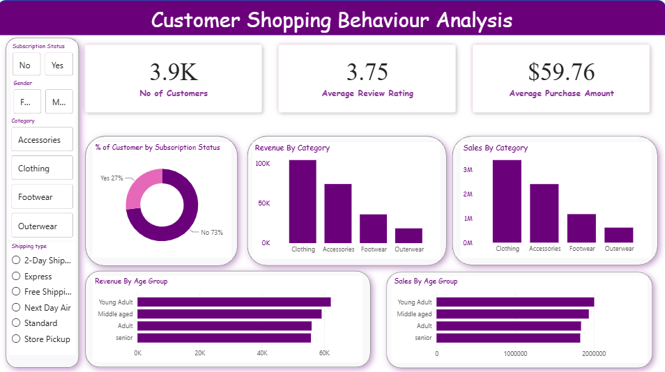

# Customer Shopping Behaviour Analysis

An end-to-end Data Analytics project that explores customer shopping behaviour using Python, SQL, PostgreSQL, and Power BI. The project focuses on cleaning raw data, performing exploratory data analysis, answering business questions with SQL, engineering useful features, and building an interactive dashboard.

## Project Overview

This project analyzes customer purchasing patterns to uncover business insights such as:

- Customer demographics
- Sales performance
- Revenue by product category
- Customer segmentation
- Subscription behaviour
- Shopping trends

---

## Tools & Technologies

- Python
- Pandas
- NumPy
- PostgreSQL
- SQL
- Power BI
- Jupyter Notebook
- Git & GitHub

---

## Project Workflow

### 1. Data Cleaning
- Handled missing values
- Removed duplicates
- Corrected data types
- Checked data quality

### 2. Exploratory Data Analysis (EDA)
- Customer demographics
- Purchase behaviour
- Revenue analysis
- Product category analysis
- Shopping trends

### 3. Feature Engineering
- Customer Segmentation
- Age Groups
- Purchase Categories
- Business metrics for analysis

### 4. SQL Analysis
Implemented SQL concepts including:

- Basic Queries
- Filtering
- Sorting
- Aggregate Functions
- GROUP BY
- HAVING
- CASE Statements
- Window Functions
- Common Table Expressions (CTEs)
- Business Problem Solving Queries

### 5. Power BI Dashboard

Interactive dashboard including:

- Total Customers
- Average Purchase Amount
- Average Review Rating
- Revenue by Category
- Sales by Category
- Revenue by Age Group
- Sales by Age Group
- Subscription Status Analysis
- Interactive Filters


---

## Dashboard Preview



---

## Project Structure

```
Customer-Shopping-Behaviour-Analysis/
│
├── data/
│   └── raw/
│
├── notebooks/
│   └── Customer_Shopping_behaviour_Analysis.ipynb
│
├── sql/
│   ├── basic_queries.sql
│   ├── filtering.sql
│   ├── aggregation.sql
│   ├── groupby.sql
│   ├── window_functions.sql
│   ├── cte.sql
│   └── business_questions.sql
│
│
├── Customer_Shopping_Behaviour.pbix
└── README.md
```
## SQL Business Analysis

The project includes advanced SQL queries to answer real-world business questions using PostgreSQL.

### Key Business Insights
### 1. Average Purchase Amount by Shipping Type
Compared the average purchase amount between **Express** and **Standard** shipping methods to identify differences in customer spending.


### 2. Revenue Analysis by Subscription Status
Analyzed customer count, average purchase amount, and total revenue generated by subscribed and non-subscribed customers.


### 3. Top Discounted Products
Identified the five most frequently purchased products with discounts and calculated their contribution to total discounted purchases.


### 4. Customer Segmentation
Classified customers into **New**, **Returning**, and **Loyal** segments using Common Table Expressions (CTEs) and CASE statements.


### 5. Top Products by Category
Ranked the three most purchased products within each category using `ROW_NUMBER()` and window functions.


---
## Key Findings

- Clothing generated the highest total revenue among all categories.
- Non-subscribed customers accounted for approximately 73% of all customers.
- Express shipping had a higher average purchase amount than Standard shipping.
- Loyal customers contributed a significant share of total purchases.
- The top-selling products varied across categories, with Clothing contributing the highest order volume.
- Young Adults generated the highest total revenue among all age groups.

```
